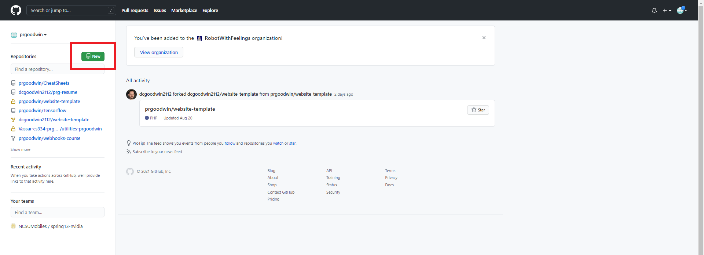
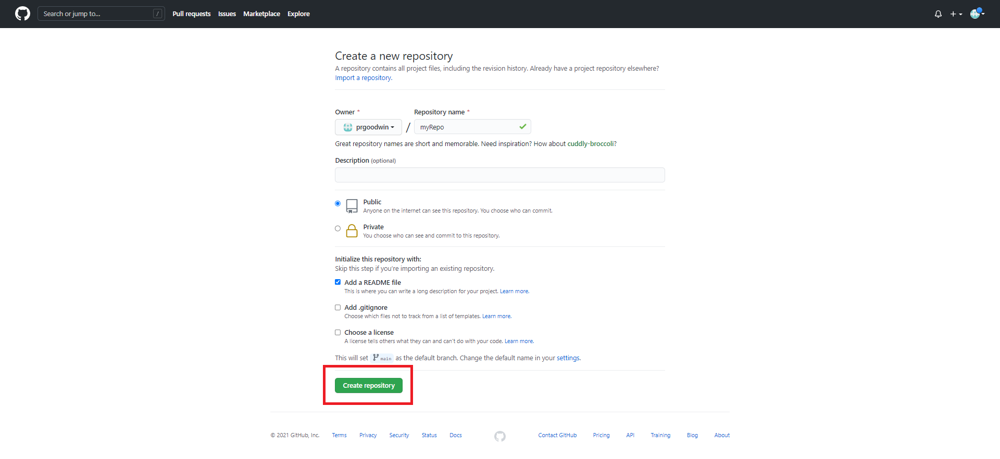
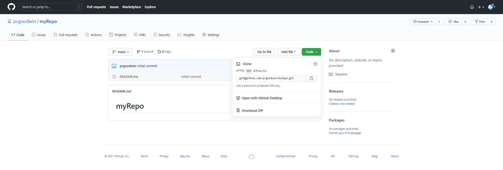

# GitHub

## Getting Started

### Initializing a repo

#### From the website








```
git clone git@github.com:prgoodwin/myRepo.git
```

#### From scratch on the command line

#### From an existing directory